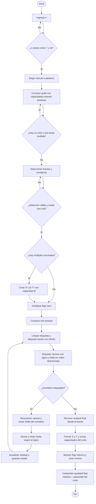

# Problema del flujo máximo

Proyecto de Matemática Computacional: Ford-Fulkerson por etiquetado, con una
interfaz didáctica en español. Python 3.12 o posterior.

## Ejecutar desde VS Code

Abre esta carpeta (`flujo-maximo`) en VS Code y abre una terminal dentro de ella:

```powershell
python -m venv .venv
.\.venv\Scripts\Activate.ps1
python -m pip install -r requirements.txt
streamlit run app.py
```

Si PowerShell no permite activar el entorno, no necesitas cambiar su política:

```powershell
.\.venv\Scripts\python.exe -m pip install -r requirements.txt
.\.venv\Scripts\python.exe -m streamlit run app.py
```

También funciona directamente con `pip install -r requirements.txt` y
`streamlit run app.py` si tu entorno ya está activo. Abre la dirección que
aparezca en la terminal, normalmente http://localhost:8501. Detén el servidor
con Ctrl+C. Ejecuta desde esta carpeta para que se cargue el tema visual.

## Archivos

| Archivo | Responsabilidad |
| --- | --- |
| `ford_fulkerson.py` | Validación, ejemplos, generación, residual, etiquetas, actualización y corte manual. |
| `app.py` | Recorrido de la interfaz Streamlit: formularios, navegación y resultados. |
| `interfaz.py` | Callbacks de sesión, presentación de validaciones, tablas e informe TXT. |
| `canvas_grafo.py` | Figuras Plotly, distribución y persistencia de posiciones, conexión con el canvas. |
| `canvas_gestos.js` | Gestos y geometría de aristas: desplazar, mover nodos y zoom. |
| `test_algorithm.py` | Pruebas con asserts y comprobación opcional de la interfaz. |
| `requirements.txt` | Solo Streamlit, NetworkX y Plotly, en las versiones utilizadas. |
| `.streamlit/config.toml` | Tema nativo rojo/blanco y sidebar oscuro, sin CSS ni imágenes externas. |
| `.gitignore` | Excluye entorno virtual, cachés y secretos del repositorio. |
| `README.md` | Ejecución, fundamentos para sustentar y diagrama. |

El pequeño directorio `.streamlit` es necesario para configurar el tema con
las opciones nativas. El adaptador del canvas usa JavaScript mediante los
componentes v2 de Streamlit para los gestos que `st.plotly_chart` no ofrece.
Reutiliza el Plotly instalado, sin CDN, dependencias adicionales ni compilación frontend.
`canvas_grafo.py` lee `canvas_gestos.js` junto a su propio archivo mediante
`pathlib.Path(__file__)`; no depende del directorio desde el que se importa.

`app.py` usa los auxiliares de `interfaz.py`, consulta el algoritmo en
`ford_fulkerson.py` y entrega sus estados a `canvas_grafo.py`. El algoritmo
permanece independiente de Streamlit y de la representación visual.

## Recorrido de la aplicación

1. Carga un ejemplo desde el sidebar o selecciona **Crear grafo manual**.
   Esta selección borra por completo la red anterior, terminales, posiciones,
   flujos, historial y resultados. **Nueva red manual** permite repetir ese reinicio.
2. En manual, usa **Crear los n nodos** (n entre 7 y 16) o **Agregar nodo**
   para añadir A, B, C… individualmente. Puedes agregar aristas mientras construyes;
   ejecutar requiere obligatoriamente entre 7 y 16 nodos. Cambiar n ajusta una red
   ya creada y conserva solo las aristas cuyos extremos siguen existiendo.
   Edita las capacidades o elimina conexiones con los controles existentes.
   Los ciclos se resaltan en rojo y bloquean el algoritmo hasta eliminar
   una de sus aristas. También puedes generar un DAG aleatorio.
3. Selecciona fuente/sumidero únicos o varios terminales. Debe existir al menos
   una ruta entre los conjuntos. Las selecciones deben ser disjuntas.
4. Pulsa **Iniciar Ford-Fulkerson**. La vista inicial tiene flujo cero.
   Usa **Siguiente**, **Anterior**, **Ver resultado final** y **Reiniciar algoritmo**.
5. En cada iteración consulta las etiquetas, Delta, el camino y las pestañas de
   flujo y residual. Puedes comparar antes y después de aplicar el incremento
   y consultar el residual de cada paso del camino. Todas las etiquetas muestran
   **capacidad/flujo**: por ejemplo, `8/0` antes de enviar flujo y `8/5` después.
   La residual sigue mostrando únicamente la capacidad residual disponible.
6. En el estado final revisa el corte y descarga el informe TXT.

Editar el grafo, cambiar n o cambiar los terminales descarta los resultados
anteriores. Los estados son propios de cada sesión y se pierden al cerrarla.
El historial solo muestra incrementos ya aplicados en la vista elegida.

Los gráficos mantienen las posiciones y la vista entre iteraciones y entre
las pestañas de flujo/residual. Arrastrar el fondo con clic izquierdo o derecho
desplaza el canvas; arrastrar un nodo mueve únicamente ese nodo y sus aristas.
La rueda o el gesto de dos dedos hacen zoom; arrastrar con un solo puntero nunca
hace zoom. En móvil, un dedo sobre el fondo desplaza la vista y dos dedos amplían
o reducen. **Centrar vista** permite recuperar todos los nodos después de desplazarlos.
En redes densas
puedes ocultar los valores y consultar las aristas con el cursor o las tablas.
Las flechas residuales opuestas se dibujan separadas. El ámbar resalta el
camino; el trazo discontinuo permite reconocer un paso inverso incluso resaltado.

## Ejemplos para la sustentación

| Ejemplo | Terminales | Flujo máximo |
| --- | --- | ---: |
| 1. Fuente y sumidero únicos | A → G | 14 |
| 2. Múltiples terminales | {A, B} → {F, G} | 18 |
| 3. Devolver flujo | A → G | 2 |

En el tercero, todas las capacidades son 1. El primer camino es
`A → B → D → G`. El segundo es `A → C → D → B → E → F → G`.
El paso **D → B** tiene signo negativo: reduce de 1 a 0 el flujo de la arista
original **B → D**. Esto libera una asignación previa y permite llegar al valor 2.

## Cómo explicar el algoritmo

Las capacidades se almacenan en un diccionario `{(origen, destino): capacidad}`.
El flujo es otro diccionario con las mismas aristas. Todos sus valores son enteros.
NetworkX representa el DAG, detecta ciclos y calcula posiciones. No resuelve
el flujo, el etiquetado, la accesibilidad ni el corte mínimo.

El punto de entrada matemático es `ford_fulkerson()`:

1. `preparar_red()` valida los datos y agrega terminales ficticios si corresponde.
2. Inicializa todos los flujos en cero.
3. `crear_red_residual()` calcula las posibilidades de avanzar o devolver flujo.
4. `etiquetar_nodos()` propaga etiquetas explícitas desde la fuente.
5. Si el sumidero recibe etiqueta, reconstruye el camino, actualiza el flujo y
   guarda un estado independiente. Repite desde etiquetas vacías.
6. Si no recibe etiqueta, calcula manualmente el corte y devuelve el resultado.

**Etiquetado.** La etiqueta de y tiene predecesor x, signo y Delta.
La fuente comienza con `(−, ∞)`; en el código se usa `None` solo para ese Delta.
Se continúa desde el último nodo etiquetado y se prueban los vecinos en orden
alfabético; si no hay nuevos vecinos, se retrocede. Es un recorrido en profundidad
determinista, explicado mediante etiquetas. No busca necesariamente el camino más corto.

- Directa x → y: residual `c(x,y) − f(x,y)`. Etiqueta `(x+, min(Delta(x), residual))`.
- Inversa x → y de una arista original y → x: residual `f(y,x)`.
  Etiqueta `(x−, min(Delta(x), residual))`.

**Actualización.** Delta del sumidero es el cuello de botella. Por cada paso
positivo se suma Delta al flujo original; por cada paso negativo se resta.
No se crean flujos negativos. Cada nodo intermedio recibe y entrega el mismo
incremento neto, por lo que se mantiene la conservación.

**Residual.** Solo contiene aristas de capacidad positiva, junto a su signo y
la arista original a la que pertenecen. El DAG original no puede tener dos
aristas opuestas porque formarían un ciclo; por eso no hay ambigüedad al
almacenar cada dirección residual. Los ciclos en la residual sí son válidos.

**Múltiples terminales.** Se añade S* cuando hay varias fuentes y T* cuando
hay varios sumideros. Cada conexión ficticia usa
`M = 1 + suma de todas las capacidades originales`. Es un entero mayor que
cualquier flujo posible. Además evita empates que harían aparecer aristas
ficticias en un corte mínimo. Los nodos ficticios no cuentan para el límite
de 7 a 16 nodos originales. Solo se exige alguna ruta entre los conjuntos;
un terminal seleccionado sin conexión útil puede contribuir cero al flujo.

**Corte mínimo.** `nodos_alcanzables()` recorre manualmente las aristas positivas
de la residual final desde la fuente. Los visitados forman S y los demás T.
`calcular_corte_minimo()` suma las capacidades de las aristas de S a T en
la red previa a crear la residual. Con la elección de M, las aristas de este
corte siempre pertenecen al grafo original, aunque S y T incluyan nodos ficticios.
Estas aristas están saturadas y no existe flujo positivo de T hacia S.
Por conservación, el valor del flujo coincide con la capacidad del corte:
esa igualdad certifica que ambos son óptimos.

**Terminación y coste.** Con capacidades enteras, cada aumento agrega al menos
1 y el flujo está acotado. Esta versión prioriza claridad: el etiquetado
revisa hasta O(V²) candidatos por iteración. Si hay k aumentos, el coste es
O(k·(V² + E log E)), incluyendo el ordenamiento de las aristas residuales;
los estados usan O(k·(V+E)) memoria. Como todo Ford-Fulkerson con elección
arbitraria de caminos, capacidades grandes pueden exigir muchos aumentos.
Para la práctica se recomiendan capacidades entre 1 y 20.

## Refactorización y equivalencia

Referencia: versión `454d4f9`, antes de esta refactorización. El conteo incluye
líneas vacías, comentarios y docstrings; no se eliminó formato para reducirlo.

| Archivo | Antes | Después | Reducción | Cambio principal |
| --- | ---: | ---: | ---: | --- |
| `app.py` | 544 | 311 | 42,8 % | Reutiliza auxiliares de estado, tablas, validaciones y gráficos. |
| `canvas_grafo.py` | 244 | 163 | 33,2 % | Agrupa los gráficos y carga el JavaScript separado. |
| `ford_fulkerson.py` | 239 | 237 | 0,8 % | Generación con `itertools`; flujo cero con `dict.fromkeys`. |
| `test_algorithm.py` | 255 | 232 | 9,0 % | Una interacción común de AppTest y excepciones con `unittest`. |
| `interfaz.py` | 0 | 129 | Nuevo | Auxiliares extraídos de la interfaz y reutilizados. |
| **Total Python** | **1.282** | **1.072** | **16,4 %** | Incluye el módulo nuevo. |
| `canvas_gestos.js` | Dentro del Python | 183 | Extraído | El JavaScript conserva exactamente su contenido original. |
| **Total Python + JavaScript** | **1.282** | **1.255** | **2,1 %** | Reducción neta, sin contar los traslados como eliminación. |

La reducción de los archivos Python combina organización y eliminación de
duplicación. La reducción neta del código es más moderada porque se mantiene
explícito el algoritmo académico y no se eliminan funcionalidades ni pruebas.

Se eliminó el cálculo de curvas, flechas y centros de etiquetas en Python:
el renderer JavaScript ya recalculaba esa geometría antes del primer dibujo
y al mover los nodos. `mostrar_red` reúne posiciones, terminales ficticios y
canvas para las vistas de flujo, residual y previa. `mostrar_validacion` reúne
el manejo común de `ValueError`, y `mostrar_tabla` usa `functools.partial` para
compartir las mismas opciones de Streamlit. La interacción de las pruebas
comprueba excepciones después de cada cambio sin repetir esa comprobación.

Se usa la biblioteca estándar (`pathlib`, `contextlib`, `functools`, `itertools`
y `unittest`) y las mismas dependencias de `requirements.txt`: Streamlit,
NetworkX y Plotly. **No se agregó ninguna dependencia.** `pairwise` construye
la cadena inicial y `combinations` enumera aristas en el mismo orden que antes;
se conserva la secuencia del generador aleatorio. El etiquetado, los caminos,
la actualización de flujo y el corte mínimo siguen implementados manualmente.

Verificación realizada:

- Compilación de los cinco módulos Python y ejecución de la aplicación.
- Suite matemática y suite de interacción de Streamlit completas.
- Comparación con la versión anterior: 45 estados de interfaz y 123 resultados
  completos, incluidas etiquetas, caminos, flujos, residuales y cortes idénticos.
  Para las figuras se compararon estilos y metadatos; la geometría inicial que
  ahora calcula el renderer se verificó en navegador.
- Informes TXT idénticos byte por byte y tablas equivalentes en los 123 casos.
- 120 grafos aleatorios idénticos, abarcando todos los tamaños de 7 a 16 nodos.
- JavaScript extraído idéntico al original; gestos comprobados en Chrome:
  arrastre izquierdo/derecho, movimiento de un nodo, rueda, persistencia entre
  pasos y emulación móvil con uno y dos dedos. La emulación no sustituye una
  prueba en un teléfono físico.

## Pruebas

```powershell
python test_algorithm.py
python -m py_compile app.py interfaz.py canvas_grafo.py ford_fulkerson.py test_algorithm.py
python test_algorithm.py --interfaz
```

Las pruebas revisan capacidad, conservación, determinismo, uso real de aristas
inversas, terminales ficticios, validaciones y la igualdad flujo/corte.
También comparan 120 casos con un oráculo independiente que enumera todos los
cortes pequeños, sin utilizar ningún solucionador externo de flujo máximo.
La opción `--interfaz` usa AppTest, incluido en Streamlit, y recorre los ejemplos,
la navegación, la edición, la invalidación, la generación de 16 nodos y el
reinicio manual desde un resultado con múltiples terminales. Comprueba también
la creación incremental, los ciclos durante la edición y el formato capacidad/flujo.
Los gestos se verifican en navegador: clic izquierdo/derecho, arrastre de un nodo,
rueda, persistencia entre pasos y emulación de un dedo/dos dedos en móvil.
AppTest por sí solo no simula los eventos del canvas ni sustituye un dispositivo físico.

## Subir a GitHub y desplegar después

Crea un repositorio vacío en GitHub. Desde esta carpeta:

```powershell
git init
git add .
git commit -m "Proyecto de flujo máximo con Ford-Fulkerson"
git branch -M main
git remote add origin https://github.com/TU_USUARIO/flujo-maximo.git
git push -u origin main
```

Sustituye `TU_USUARIO` por tu cuenta y usa tu método habitual de autenticación.
Revisa los archivos antes de subirlos. El repositorio debe incluir el archivo
oculto `.streamlit/config.toml` y excluir `.venv` y `__pycache__`.

En Streamlit Community Cloud crea una app conectada a ese repositorio, elige
`main`, indica `app.py` como archivo principal y selecciona Python 3.12.
`requirements.txt` permite instalar las tres dependencias directamente.
No se ha publicado ni desplegado automáticamente este proyecto.

Referencias oficiales: [gráficos Plotly en Streamlit](https://docs.streamlit.io/develop/api-reference/charts/st.plotly_chart),
[anotaciones y flechas de Plotly](https://plotly.com/python/reference/layout/annotations/),
[despliegue de una app](https://docs.streamlit.io/deploy/streamlit-community-cloud/deploy-your-app).

## Diagrama de flujo


